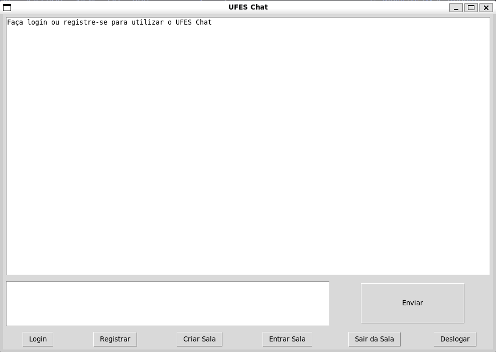
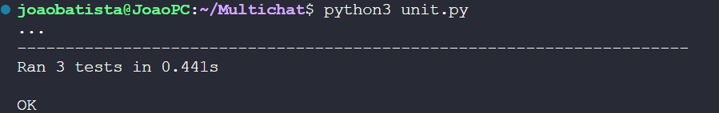
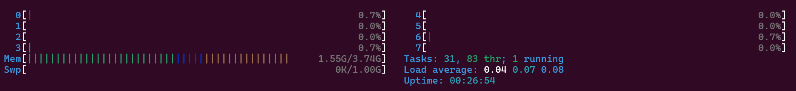
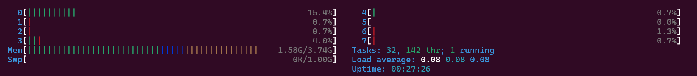

# 💬 UFES CHAT

<p align="center" style="display: flex; align-items: center; justify-content: center;">
  
</p>

## 📋 Descrição

A proposta desse projeto é implementar um servidor de chat em que os clientes podem criar e entrar em diferentes salas, cada uma com o seu próprio tema. Cada sala possui o seu conjunto de clientes e as mensagens que são enviadas nela só podem ser recebidas e lidas e pelos clientes que estão associados a ela no momento do envio da mensagem.

Os clientes podem fazer registrar-se e fazer login com um nome de usuário e uma senha. Além disso, eles poderão criar uma sala, listar as salas disponíveis, entrar em uma das salas e sair quando quiserem.

Cada sala possui um socket de comunicação com o servidor e todas as mensagens das salas passam pelo servidor criptografadas, para evitar que seu conteúdo possa ser acessado pelo servidor durante o trânsito.

## 📚 Bibliotecas e Tecnologias Utilizadas

- Python: linguagem de programação utilizada para implementar o sistema cliente-servidor
- Socket: biblioteca padrão do Python para implementar sockets de comunicação entre o servidor e os clientes
- Threading: biblioteca padrão do Python para utilização de threads, o que permitiu que as várias salas fossem construídas com multithreading
- Logging: biblioteca padrão do Python para coleta e registro de possíveis exceções geradas pelo código
- Unittest: biblioteca padrão do Python utilizada para realizar testes unitários nas funções principais do servidor.
- Tkinter: biblioteca utilizada para construir a interface gráfica para os clientes a partir de um toolkit gráfico (TK)
- Bcrypt: biblioteca utilizada para produzir hashes a partir do nome de usuário e senha, a fim de armazenar essas informações criptografadas no banco de dados de clientes
- Hashlib e Cryptography: bibliotecas utilizadas para criptografar e descriptografar as mensagens enviadas pelos clientes com criptografia simétrica.
- Python-dotenv: utilizada para ler informações de arquivos .env no código. Esses arquivos contêm parâmetros de execução do código, como IP do servidor e porta de conexão.

## ⬇️ Instalação

Para utilizar o UFES Chat, é necessário possuir o Python 3.8 ou superior. Em seguida, clone este repositório:

```
git clone https://github.com/joaoBatista04/Multichat-Crypto
```

Em seguida, realize a instalação das dependências e bibliotecas necessárias:

```
pip install -r requirements.txt
```

Por fim, configure o arquivo .env conforme as variáveis de ambiente desejadas

```
SERVER_HOST = Endereço IP do servidor. Exemplo: "127.0.0.1"
SERVER_PORT = Porta de conexão com o servidor. Exemplo: "5000"
CLIENT_LOG = Caminho do arquivo de log do cliente. Exemplo: "client.log"
SERVER_LOG = Caminho do arquivo de log do servidor. Exemplo: "server.log"
USER_DB_FILE = Caminho do arquivo para o banco de dados de clientes. Exemplo: "users.db"
```

## 🔁 Execução

Para executar o servidor, digite o comando no terminal:

```
python3 server.py
```

Com o servidor já em execução, instancie os clientes. Para executar um cliente, digite o comando no terminal:

```
python3 client.py
```

## 🧪 Como testar

Se não possuir um usuário, clique no botão `Registrar`. O sistema irá solicitar um nome de usuário e uma senha. Caso o nome de usuário já estiver em uso, o sistema informará ao usuário.

Uma vez criado o usuário, faça login para utilização das salas clicando no botão `Login`. O sistema irá solicitar novamente o nome de usuário e a senha, informando caso um deles ou ambos tenha sido digitado de forma errada.

Já logado, o usuário poderá entrar em uma das salas de bate-papo disponíveis. Para isso, clique no botão `Entrar na Sala`. A interface irá listar todas as salas disponíveis e, se não houver nenhuma disponível, informará ao usuário. O usuário então deverá digitar o nome da sala que deseja entrar. Caso digite errado ou digite o nome de uma sala não disponível, o sistema irá informar o erro. Além disso, caso o usuário já esteja em uma sala, o sistema pedirá que ele primeiro se desconecte da sala para depois entrar em outra.

Caso nenhuma sala esteja disponível, ou mesmo quando o usuário quiser, ele poderá criar uma nova sala clicando no botão `Criar Sala`. O sistema irá solicitar o nome da nova sala e a criará. Caso o número de salas já existentes seja maior do que 15, o sistema irá exibir uma mensagem de erro informando que o limite máximo foi atingido.

Dentro de uma sala, o usuário poderá escrever suas mensagens no campo de entrada que fica acima dos botões. Clicando no botão `Enviar`, a mensagem será enviada para todos os clientes que estão conectados na sala naquele momento. Caso o usuário tente enviar uma mensagem sem estar logado ou conectado a uma das salas, uma mensagem de erro será exibida.

Ao clicar em `Sair da Sala`, o usuário irá se desconectar da sala atual e poderá se conectar em outra. Caso o usuário não esteja associado a uma sala, uma mensagem de erro será exibida.

Ao clicar em `Deslogar`, o usuário irá sair de sua conta e precisará efetuar o login novamente. Caso tente se deslogar sem estar logado, uma mensagem de erro será exibida.

## 🏋️‍♂️ Testes Unitários e de Carga

Foram testadas as funcionalidades principais do servidor com testes unitários utilizando-se a biblioteca `unittest`.

<p align="center" style="display: flex; align-items: center; justify-content: center;">
  
</p>

Além disso, foi feito um teste de carga para o servidor, conectando-se múltiplos clientes simultâneos a uma mesma sala e enviando mensagens nessa sala. As imagens a seguir demonstram a utilização da memória e de threads antes e durante a execução desse teste de carga, respectivamente.

<p align="center" style="display: flex; align-items: center; justify-content: center;">
  
</p>

<p align="center" style="display: flex; align-items: center; justify-content: center;">
  
</p>

O servidor suportou até 57 clientes simultâneos conectados e enviando mensagens em uma mesma sala. A partir desse limite, o servidor passou a recusar os novos clientes.

## 🔨 Funcionalidades Implementadas

- Implementação de um servidor multithread para recebimento de múltiplos clientes simultâneos.
- Implementação de sistema multisala, em que cada sala possui um socket de comunicação e também possui multithread para o recebimento de múltiplas mensagens simultâneas.
- Implementação de ações de usuário que envolvem criar novas salas, listar, entrar e sair de salas existentes e mandar mensagens para os clientes conectados a uma determinada sala.
- Sistema de login de usuários, com as credenciais sendo armazenadas criptografadas em um banco de dados de usuários.
- Criptografia simétrica para as mensagens das salas. As mensagens são criptografadas e descriptografadas utilizando-se o protocolo AES. O nome de cada sala é criptografado com o protocolo SHA-256 e utilizado como chave para criptografia das mensagens.

## ⌛ Possíveis Melhorias Futuras

- Restrição do número de clientes associados simultaneamente a uma sala
- Solicitação de senhas para a entrada em uma sala, para criação de salas privadas
- Implementar um sistema de exibição de status de mensagem, tal como o WhatsApp
- Guardar as mensagens enviadas nas salas em um banco de dados, para que o servidor possa recuperar o histórico caso apresente erro e precise ser reiniciado.
- Implementar criptografia assimétrica às mensagens das salas. Atualmente, a criptografia simétrica é feita com o nome da sala e pode ser facilmente quebrada caso o atacante descubra de que sala a mensagem possui origem. Além disso, o sistema pode estar suscetível a ataques do tipo man-in-the-middle. O foco deste projeto não é a criptografia em si, mas sim o sistema multisalas. Assim, a criptografia simétrica garante que, ao menos, as mensagens passarão cifradas pelo servidor e não poderão ser lidas por ele.

## 👤 Agradecimentos

Um agradecimento especial ao professor Magnos Martinello, da disciplina de Redes de Computadores da Universidade Federal do Espírito Santo, que propôs e auxiliou no desenvolvimento deste projeto.